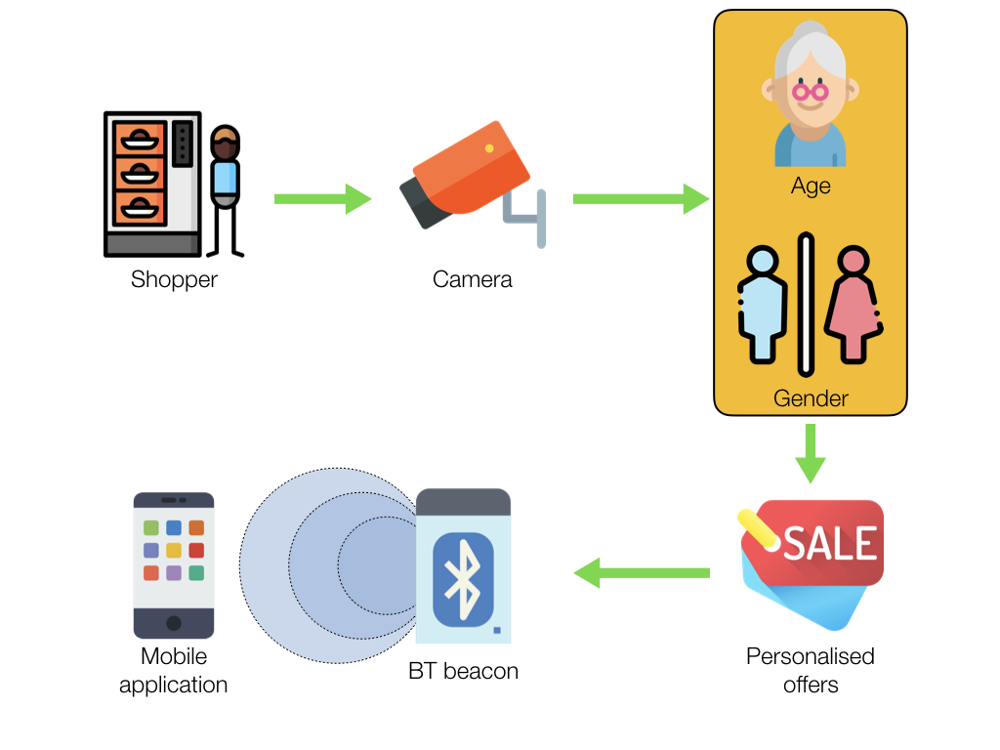

# ShopSmart

</img>

  
ShopSmart is a package of tools for retailers to enable proximity marketing in their shops. The application provides the shoppers with personalized offers based on the proximity of the items, age and gender of the customers. The flow of data for this project is as follows: 

</img>

## [Android application](https://github.com/Dheeraj1998/ShopSmart/tree/master/Android_Application)
This application is to be installed on the mobile phones of customers. It provides the customers with two different types of offers:
1. **Daily offers I/II**: These offers change on a daily basis according to the needs of the retailers. These offers are to be set with the use of the associated website.
2. **Proximity offer**: These offers are sent to the user based on their location in the store. It also takes into consideration the age and gender of the customer.  

### Application screenshots
|  |  |
| :---: | :---: |
| Login page | Offer page | 

## [Web application](https://github.com/AnshulHedau/ShopSmart-Desktop)
This application gives vendors the access to set the personalized offers based on the proximity of the items, age and gender of the customer according to the different racks/shelves. The source code for the web application can be checked [here](https://github.com/AnshulHedau/ShopSmart-Desktop).

## [Python script](https://github.com/Dheeraj1998/ShopSmart/tree/master/Python_Processing)
This script gets the input from the cameras around the store. The script will identify the age & gender of people in front of the rack. According to the location of the camera, this information is updated in Firebase to reflect the corresponding changes in the android application of the customer.

## Project details
This project was developed as part of SELECT Makathon 2019 at Vellore Institute of Technology, Vellore. The group consisted of [Dheeraj Nair](https://www.linkedin.com/in/dheeraj1998), [Anshul Hedau](https://www.linkedin.com/in/anshul-hedau), [Abhinav Kumar](https://www.linkedin.com/in/abhinavkrs) and [Animesh Kumar](https://www.linkedin.com/in/animesh-kumar-130a6a109).
